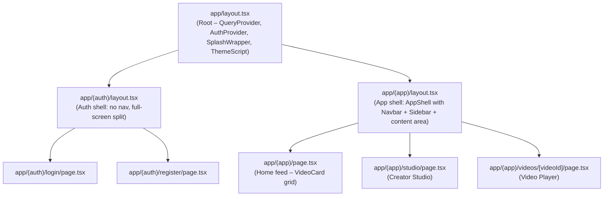
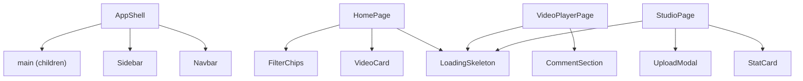
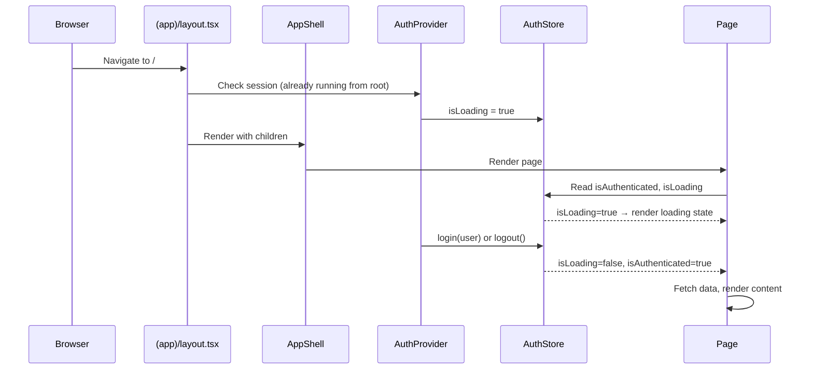
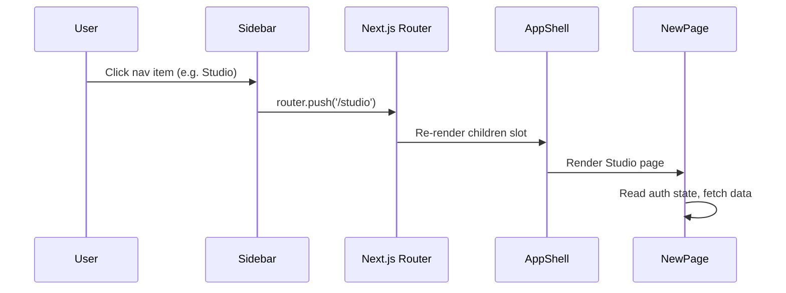

# Design Document: App Layout Redesign

## Overview

The VideoTube frontend currently suffers from a monolithic page structure where each page renders its own navigation, sidebar, and layout inline. This results in duplicated markup, no shared app shell for authenticated routes, and pages that are extremely hard to modify or extend. This redesign restructures the application into a proper Next.js 16 App Router layout hierarchy with route groups, extracted reusable components, and shared TypeScript types — while preserving all existing functionality, API calls, auth logic, theme management, and animations exactly as-is.

The goal is a clean structural skeleton the user can style freely. No visual design decisions are locked in — only the component boundaries, data flow, and file organization.

---

## Architecture

### Route Groups and Layout Hierarchy



### Component Tree



### File Structure After Redesign

```
app/
├── globals.css
├── layout.tsx                          ← Root layout (unchanged except ThemeToggleButton removed — moved into Navbar)
├── (auth)/
│   ├── layout.tsx                      ← Auth layout: no nav, renders children directly
│   ├── login/
│   │   └── page.tsx                    ← Login page (move from app/login/page.tsx)
│   └── register/
│       └── page.tsx                    ← Register page (move from app/register/page.tsx)
└── (app)/
    ├── layout.tsx                      ← App shell layout: wraps all authenticated pages with AppShell
    ├── page.tsx                        ← Home feed (clean, consumes VideoCard + LoadingSkeleton)
    ├── studio/
    │   └── page.tsx                    ← Creator Studio (cleaned up, consumes StatCard + UploadModal)
    └── videos/
        └── [videoId]/
            └── page.tsx                ← Video Player (properly designed)

src/
├── components/
│   ├── layout/
│   │   ├── AppShell.tsx                ← NEW: Persistent shell (Navbar + Sidebar + content)
│   │   ├── Navbar.tsx                  ← NEW: Top navigation bar (extracted from page.tsx)
│   │   └── Sidebar.tsx                 ← NEW: Left sidebar nav (extracted from page.tsx)
│   ├── ui/
│   │   ├── VideoCard.tsx               ← NEW: Video card (extracted from home page.tsx)
│   │   └── LoadingSkeleton.tsx         ← NEW: Skeleton loading states
│   ├── MascotAnimation.tsx             ← Keep as-is
│   ├── SplashScreen.tsx                ← Keep as-is
│   ├── SplashWrapper.tsx               ← Keep as-is
│   └── ThemeToggleButton.tsx           ← Keep as-is (also used inside Navbar)
├── providers/
│   ├── AuthProvider.tsx                ← Keep as-is
│   └── QueryProvider.tsx               ← Keep as-is
├── services/
│   └── api.ts                          ← Keep as-is
├── store/
│   ├── useAuthStore.ts                 ← Keep as-is
│   └── useThemeStore.ts                ← Keep as-is
└── types/
    └── index.ts                        ← NEW: Shared TypeScript types
```

---

## Sequence Diagrams

### Authentication Flow (App Shell)



### Navigation (Sidebar → Page transition)



---

## Components and Interfaces

### Component 1: AppShell

**Purpose**: Persistent authenticated layout wrapper rendered by `app/(app)/layout.tsx`. Contains the top Navbar and left Sidebar and provides the main content area slot.

**Interface**:

```typescript
interface AppShellProps {
  children: React.ReactNode
}

// Usage in app/(app)/layout.tsx:
export default function AppLayout({ children }: { children: React.ReactNode }) {
  return <AppShell>{children}</AppShell>
}
```

**Responsibilities**:
- Render `Navbar` at the top
- Render `Sidebar` on the left
- Render `children` in the main content area
- Handle overall page chrome layout (flex/grid container)
- Does NOT handle auth guarding — that stays in individual pages via `useAuthStore`

---

### Component 2: Navbar

**Purpose**: Top navigation bar shared across all authenticated pages. Extracted from the current inline nav in `app/page.tsx`.

**Interface**:

```typescript
interface NavbarProps {
  // No required props — reads from stores internally
}

// Internal data sources:
// - useAuthStore() → user, logout
// - useThemeStore() → theme, toggleTheme
// - useRouter() → navigation
```

**Responsibilities**:
- Render VideoTube logo/wordmark
- Render search input (currently unhandled — stub handler acceptable)
- Render theme toggle button
- Render user avatar with logout action
- Render Studio link
- Be positioned as a top bar (not a floating pill — app shell owns layout)

---

### Component 3: Sidebar

**Purpose**: Left navigation panel shared across all authenticated pages. Extracted from the current inline floating sidebar in `app/page.tsx`.

**Interface**:

```typescript
interface SidebarProps {
  // No required props — reads active route from usePathname internally
}

// Internal data sources:
// - usePathname() → active route highlighting
// - useRouter() → navigation on click
```

**Responsibilities**:
- Render navigation icons: Home, Trending, Library (minimal icon-only or icon + label)
- Highlight the active route
- Handle click navigation via `router.push`
- Be positioned as a persistent left column in the app shell

---

### Component 4: VideoCard

**Purpose**: Reusable video card component extracted from the inline rendering inside `app/page.tsx`.

**Interface**:

```typescript
interface VideoCardProps {
  video: Video           // from src/types/index.ts
  index?: number         // for staggered Framer Motion animation delay
}
```

**Responsibilities**:
- Render video thumbnail with 16:9 aspect ratio
- Render duration badge overlay
- Render owner avatar (positioned overlapping thumbnail bottom)
- Render video title (2-line clamp)
- Render owner name and view count
- Wrap entire card in a `<Link href={/videos/${video._id}}>` 
- Apply hover animation on thumbnail (scale up via Framer Motion or CSS)

---

### Component 5: LoadingSkeleton

**Purpose**: Skeleton placeholder components to replace plain `"Loading..."` text across all pages.

**Interface**:

```typescript
interface LoadingSkeletonProps {
  variant: "video-grid" | "video-player" | "studio-stats" | "studio-table" | "generic"
  count?: number   // For grid variant: how many cards to show (default: 8)
}
```

**Responsibilities**:
- Render pulsing placeholder shapes matching the real content layout
- `video-grid`: grid of card-shaped skeletons
- `video-player`: player area + info block skeleton
- `studio-stats`: 4 stat card skeletons
- `studio-table`: table row skeletons
- `generic`: simple text-line skeletons

---

## Data Models

### Shared Types (`src/types/index.ts`)

```typescript
// ── Owner (embedded in Video and Comment) ──
export interface VideoOwner {
  _id: string
  fullName: string
  username: string
  avatar: string
  subscribersCount?: number
}

// ── Video ──
export interface Video {
  _id: string
  title: string
  description?: string
  thumbnail: string
  videoFile: string
  duration: number        // seconds
  views: number
  likesCount?: number
  isPublished: boolean
  owner?: VideoOwner
  createdAt: string
  updatedAt: string
}

// ── Comment ──
export interface Comment {
  _id: string
  content: string
  owner?: {
    _id: string
    fullName: string
    avatar: string
  }
  likesCount?: number
  createdAt: string
}

// ── User (from useAuthStore — duplicated here for type imports) ──
export interface User {
  _id: string
  fullName: string
  username: string
  email: string
  avatar: string
  coverImage?: string
}

// ── Dashboard Stats ──
export interface ChannelStats {
  totalViews: number
  totalSubscribers: number
  totalLikes: number
  totalVideos: number
}

// ── Studio Video (dashboard/videos response) ──
export interface StudioVideo {
  _id: string
  title: string
  thumbnail: string
  isPublished: boolean
  views: number
  likesCount: number
  createdAt: string
}

// ── API Response wrapper ──
export interface PaginatedResponse<T> {
  docs: T[]
  totalDocs: number
  page: number
  limit: number
  totalPages: number
  hasNextPage: boolean
  hasPrevPage: boolean
}
```

**Validation Rules**:
- `Video._id`, `Video.title`, `Video.thumbnail`, `Video.videoFile` are required
- `Video.duration` is a non-negative number (seconds)
- `Video.views` is a non-negative integer
- `Comment.content` must be a non-empty string
- `User._id`, `User.fullName`, `User.avatar` are required

---

## Key Technical Decisions

### 1. Auth Guard Strategy

**Decision**: Auth guarding stays in each individual page (`useAuthStore` + `useEffect` redirect), NOT in the `(app)/layout.tsx`.

**Rationale**: Moving auth guarding into the layout would create a flash-of-content problem during the `isLoading=true` phase. The current per-page approach where each page renders a loading spinner while `authLoading` is true and then redirects if unauthenticated is already correct and should be preserved. The app shell layout only adds structural chrome.

### 2. ThemeToggleButton Placement

**Decision**: The existing `ThemeToggleButton` component in `app/layout.tsx` (which floats globally) is replaced by embedding theme toggle logic directly in the `Navbar` component. The existing `ThemeToggleButton.tsx` file is kept as-is.

**Rationale**: A floating global button overlapping page content is not clean. The Navbar provides a natural, expected location for theme toggling. The existing `ThemeToggleButton` component file remains available for reuse or standalone usage.

### 3. Filter Chips (Home Page)

**Decision**: The filter chips (`For You`, `Design`, `Engineering`, etc.) are kept in `app/(app)/page.tsx` with the existing `activeCategory` state. They remain non-functional (no API filtering) as the backend does not expose a category filter endpoint yet.

**Rationale**: The spec asks to keep all existing functionality. The chips exist for visual completeness. A `TODO` comment is added to wire them up when the backend supports it.

### 4. UploadModal and StatCard

**Decision**: `UploadModal` and `StatCard` remain co-located in `app/(app)/studio/page.tsx` as internal components (not moved to `src/components`).

**Rationale**: These components are tightly coupled to studio-specific logic (`useQueryClient`, upload progress, stats data). They don't need to be shared globally. The studio page becomes cleaner but they stay within it.

### 5. Video Player Layout

**Decision**: The video player page receives a proper page layout using Tailwind/CSS-variables, replaces `alert()` calls with inline UI feedback, and replaces the emoji `👍` button with a proper SVG icon button. All API calls (`api.post` for likes, `api.post` for comments) are preserved unchanged.

**Rationale**: The video player is described as "very rough" and needs structural cleanup while keeping the same API interactions.

---

## Algorithmic Pseudocode

### App Shell Rendering

```pascal
PROCEDURE renderAppShell(children)
  INPUT: children (React.ReactNode)
  OUTPUT: JSX with Navbar, Sidebar, and content area

  SEQUENCE
    user ← useAuthStore().user
    pathname ← usePathname()
    
    RETURN (
      <div className="app-shell-container">   // flex-row, full-height
        <Sidebar activePath={pathname} />
        <div className="app-shell-right">     // flex-col, flex-1
          <Navbar user={user} />
          <main className="app-shell-content">
            {children}
          </main>
        </div>
      </div>
    )
  END SEQUENCE
END PROCEDURE
```

**Preconditions:**
- `children` is valid React.ReactNode
- `useAuthStore` and `usePathname` hooks are accessible

**Postconditions:**
- Navbar is always rendered at the top of the right column
- Sidebar is always rendered on the left
- `children` are rendered inside `<main>` without modification

---

### Auth Guard Pattern (per page)

```pascal
PROCEDURE useAuthGuard()
  INPUT: (no parameters — reads from store)
  OUTPUT: { shouldRender: boolean, isChecking: boolean }

  SEQUENCE
    { isAuthenticated, isLoading } ← useAuthStore()
    router ← useRouter()

    EFFECT on [isLoading, isAuthenticated]:
      IF NOT isLoading AND NOT isAuthenticated THEN
        router.push("/login")
      END IF
    END EFFECT

    IF isLoading OR NOT isAuthenticated THEN
      RETURN { shouldRender: false, isChecking: true }
    ELSE
      RETURN { shouldRender: true, isChecking: false }
    END IF
  END SEQUENCE
END PROCEDURE
```

**Preconditions:**
- `useAuthStore` must be initialized (done by `AuthProvider` on mount)
- `isLoading` starts as `true` by default

**Postconditions:**
- If `isLoading=true`: renders loading spinner, no redirect
- If `isLoading=false, isAuthenticated=false`: redirects to `/login`
- If `isLoading=false, isAuthenticated=true`: renders page content

**Loop Invariants:** N/A (effect-based, not iterative)

---

### VideoCard Rendering

```pascal
PROCEDURE renderVideoCard(video, index)
  INPUT: video of type Video, index of type number (optional)
  OUTPUT: JSX for a single video card

  SEQUENCE
    duration ← formatDuration(video.duration)
    views    ← formatViewCount(video.views)
    delay    ← MIN(index * 0.05, 0.5)  // cap animation stagger at 500ms

    RETURN (
      <motion.div
        initial={{ opacity: 0, y: 20 }}
        animate={{ opacity: 1, y: 0 }}
        transition={{ delay, duration: 0.4 }}
      >
        <Link href={`/videos/${video._id}`}>
          <ThumbnailArea thumbnail={video.thumbnail} duration={duration} ownerAvatar={video.owner?.avatar} />
          <InfoArea title={video.title} owner={video.owner?.fullName} views={views} />
        </Link>
      </motion.div>
    )
  END SEQUENCE
END PROCEDURE

FUNCTION formatDuration(seconds)
  INPUT: seconds of type number
  OUTPUT: string in "M:SS" format

  minutes ← FLOOR(seconds / 60)
  secs    ← FLOOR(seconds MOD 60)
  RETURN `${minutes}:${secs.toString().padStart(2, "0")}`
END FUNCTION

FUNCTION formatViewCount(views)
  INPUT: views of type number
  OUTPUT: human-readable string

  IF views >= 1000000 THEN
    RETURN `${(views / 1000000).toFixed(1)}M`
  ELSE IF views >= 1000 THEN
    RETURN `${(views / 1000).toFixed(1)}K`
  ELSE
    RETURN views.toString()
  END IF
END FUNCTION
```

**Preconditions:**
- `video._id` is a non-empty string
- `video.thumbnail` is a valid URL string
- `index` ≥ 0

**Postconditions:**
- Renders exactly one `<Link>` wrapping the entire card
- Duration badge is always visible
- Framer Motion animation delay is bounded (≤ 500ms)

---

## Error Handling

### Error Scenario 1: Auth Session Expired Mid-Session

**Condition**: User's access token expires while they're on an authenticated page. API returns `401`.

**Response**: The existing `api.ts` interceptor automatically attempts a token refresh via `POST /users/refresh-token`. If refresh succeeds, the original request is retried transparently. If refresh fails, `logout()` is called via the auth store, and the next auth guard check redirects to `/login`.

**Recovery**: User is redirected to login, where they can re-authenticate. No data is lost.

---

### Error Scenario 2: Video Not Found

**Condition**: `GET /videos/:videoId` returns 404.

**Response**: The video player page receives `video = undefined`. The component renders an inline error message: "Video not found" with a back-navigation button.

**Recovery**: User can navigate back to home feed.

---

### Error Scenario 3: Comment Post Failure

**Condition**: `POST /comments/:videoId` fails (network error or server error).

**Response**: Replace the current `alert("Failed to post comment")` with an inline error state: a small red error message below the comment form. The input is preserved so the user can retry.

**Recovery**: User retries the comment submission. Input is not cleared on failure.

---

### Error Scenario 4: Video Upload Failure

**Condition**: `POST /videos` (multipart upload) fails during or after upload.

**Response**: `UploadModal` already handles this with `setError("Upload failed. Please try again.")`. Behavior is preserved as-is.

**Recovery**: User can retry the upload with the same form data still populated.

---

### Error Scenario 5: Videos Feed Fails to Load

**Condition**: `GET /videos` returns an error.

**Response**: TanStack Query's `error` state is truthy. The home page renders: "Failed to load videos. Please try refreshing."

**Recovery**: User can manually refresh or wait for the query to retry.

---

## Testing Strategy

### Unit Testing Approach

Test individual components in isolation:

- `VideoCard`: Given a `Video` object, renders thumbnail, title, owner name, duration badge, and links to the correct URL.
- `LoadingSkeleton`: Renders the expected number of skeleton elements per variant.
- `Sidebar`: Active route item receives an active style; clicking a non-active item calls `router.push` with the correct path.
- `Navbar`: Logout button calls `api.post("/users/logout")` and then `useAuthStore().logout()`.
- `formatDuration` / `formatViewCount`: Pure functions — unit testable with table-driven tests.

### Property-Based Testing Approach

**Property Test Library**: fast-check

Properties worth verifying:

1. **`formatDuration` is total and bounded**: For any non-negative integer `seconds`, `formatDuration(seconds)` returns a string matching `/^\d+:\d{2}$/`.
2. **`formatViewCount` is monotonically formatted**: For any `views ≥ 1000000`, the result ends with `"M"`. For `1000 ≤ views < 1000000`, it ends with `"K"`.
3. **`VideoCard` never renders a broken link**: For any valid `Video` object, the rendered `href` prop equals `/videos/${video._id}`.
4. **Auth guard redirect invariant**: For any combination of `{isAuthenticated: false, isLoading: false}`, `router.push("/login")` is called exactly once.

### Integration Testing Approach

- Render `(app)/layout.tsx` with a mock `AppShell` and verify that `Navbar` and `Sidebar` are present in the output.
- Render home page with a mocked TanStack Query response and verify `VideoCard` components appear for each video in the response.
- Render the video player page with a mocked video response and verify title, description, and video element are rendered correctly.

---

## Performance Considerations

- **Skeleton screens** eliminate the perceived loading gap. All loading states show `LoadingSkeleton` rather than empty space or "Loading..." text.
- **Framer Motion animation stagger** for video grid is capped at 500ms total regardless of video count, preventing animation queuing issues on large grids.
- **Sidebar and Navbar** are rendered once in the layout and never re-mounted on page transitions — Next.js App Router preserves layout components across navigations within the same route group.
- **VideoCard thumbnails** use native `` (same as current codebase) — upgrading to `<Image>` (Next.js optimized) can be done in a later pass without architecture changes.
- **TanStack Query caching** is already configured. Extracted components simply receive data as props rather than fetching independently, avoiding duplicate requests.

---

## Security Considerations

- **Auth guard**: Every authenticated page (`(app)/*`) reads `useAuthStore().isAuthenticated` and redirects to `/login` if false. This is a client-side guard and is complemented by the API server's own session validation.
- **API calls**: All calls go through `api.ts` with `withCredentials: true`. No tokens are stored in `localStorage` or `sessionStorage` — only HTTP-only cookies managed by the backend.
- **Comment/Like actions**: Already require an authenticated session enforced server-side. The `alert()` replacement for error messages does not expose server error details to the user.
- **Image sources**: Avatar and thumbnail URLs come from the backend (Cloudinary CDN). No user-controlled `src` attributes are passed directly without going through the API response.

---

## Dependencies

All dependencies are already installed. No new packages are introduced:

| Dependency | Purpose | Already Installed |
|---|---|---|
| `next` 16 | App Router, layouts, routing | ✅ |
| `react` 19 | Component model | ✅ |
| `typescript` | Type safety, shared types | ✅ |
| `@tanstack/react-query` | Server state, data fetching | ✅ |
| `zustand` | Auth and theme state | ✅ |
| `framer-motion` | Animations on VideoCard and pages | ✅ |
| `axios` | HTTP client via `api.ts` | ✅ |
| `tailwindcss` 4 | Utility CSS (where applicable) | ✅ |

---

## Correctness Properties

1. **Navigation isolation**: Every page under `app/(app)/*` has access to `Navbar` and `Sidebar` exactly once, and every page under `app/(auth)/*` has neither.

2. **Type safety**: All API response data consumed by components uses types from `src/types/index.ts`. No inline `interface` or `type` declarations exist in page files for `Video`, `Comment`, `User`, or `ChannelStats`.

3. **Auth guard completeness**: Every page under `app/(app)/*` that calls authenticated API endpoints also reads `useAuthStore().isAuthenticated` and redirects to `/login` when `isAuthenticated === false && isLoading === false`.

4. **No functional regression**: All existing API calls (`api.get`, `api.post`) in the original page files are preserved identically in the refactored pages. No API endpoint, query key, or mutation is removed or altered.

5. **Component extraction purity**: `VideoCard` renders identically to the inline video card rendering in the original `app/page.tsx` when given the same `Video` data. The visual output (thumbnail, title, owner, views, duration, link href) is identical.

6. **Loading state coverage**: Every page that fetches data from the API renders a `LoadingSkeleton` while `isLoading === true`, replacing all occurrences of plain text "Loading..." or empty `<div>` states.

7. **Route group transparency**: Next.js route groups `(auth)` and `(app)` do not appear in the browser URL. `/login` routes to `app/(auth)/login/page.tsx` and `/` routes to `app/(app)/page.tsx`.
