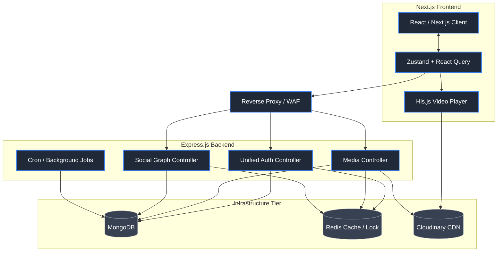
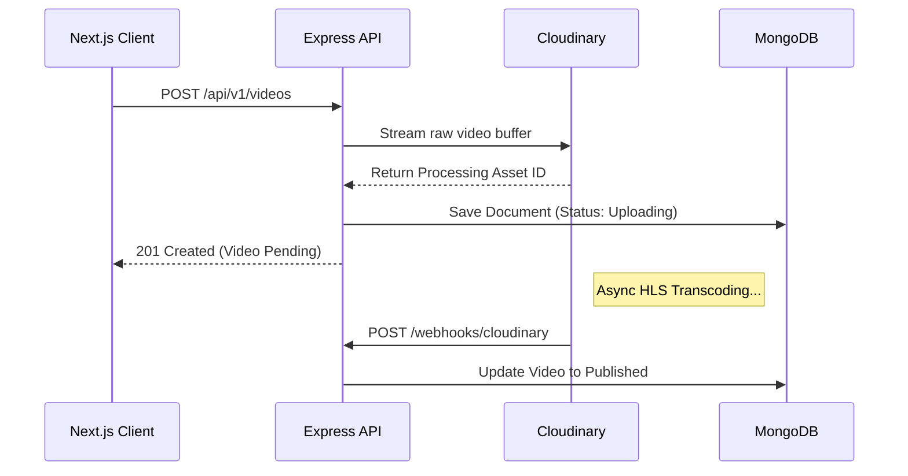

# VideoTube — Enterprise-Grade Full Stack Video Platform

[](https://nodejs.org)
[](https://expressjs.com)
[](https://nextjs.org)
[](https://mongodb.com)
[](https://redis.io)
[](https://cloudinary.com)
[](https://zustand-demo.pmnd.rs/)

A production-ready, highly scalable video-sharing platform built with a modern TypeScript/Node.js stack and a blazing fast Next.js React frontend. Engineered for high availability, the platform features adaptive bitrate video streaming, real-time telemetry, highly responsive UI micro-animations, and a heavily optimized caching layer.

> [!NOTE]
> **Prototype & Infrastructure Notice:**
> This repository is currently built and deployed as a portfolio prototype. To maintain zero running costs, it relies entirely on the **Free Tiers** of various managed services (MongoDB Atlas, Cloudinary CDN, Render/Vercel, and Redis). Because of these free-tier constraints, you may occasionally experience slower initial load times (cold starts), strict storage limits on video uploads, and capped bandwidth for HLS streaming. The underlying architecture, however, is fully production-ready and built to scale on paid infrastructure.

---

## ✦ System Architecture

The application follows a decoupled, service-oriented architecture, utilizing Redis for high-throughput locking, MongoDB for persistent state, and React Query on the client for intelligent caching.


```mermaid
graph TD
    %% Define Client Layer
    subgraph Client Layer [Next.js Frontend]
        Web[React / Next.js Client]
        State[Zustand + React Query]
        Player[Hls.js Video Player]
    end

    %% Define Load Balancing / Proxy
    Proxy[Reverse Proxy / WAF]

    %% Define Application Layer
    subgraph Application Tier [Express.js Backend]
        Auth[Unified Auth Controller]
        Media[Media Controller]
        Social[Social Graph Controller]
        Jobs[Cron / Background Jobs]
    end

    %% Define Infrastructure Services
    subgraph Infrastructure Tier
        Mongo[(MongoDB)]
        RedisCache[(Redis Cache / Lock)]
        Cloudinary[(Cloudinary CDN)]
    end

    %% Connections
    Web <--> State
    State --> Player
    Player --> Cloudinary
    State --> Proxy
    Proxy --> Auth
    Proxy --> Media
    Proxy --> Social

    Auth --> Mongo
    Auth --> RedisCache
    Media --> Mongo
    Media --> Cloudinary
    Media --> RedisCache
    Social --> Mongo
    Social --> RedisCache
    Jobs --> Mongo

    %% Styling
    classDef primary fill:#1f2937,stroke:#3b82f6,stroke-width:2px,color:#ffffff;
    classDef secondary fill:#374151,stroke:#9ca3af,stroke-width:1px,color:#ffffff;
    
    class Web,State,Player,Proxy,Auth,Media,Social,Jobs primary;
    class Mongo,RedisCache,Cloudinary secondary;
```

### Video Upload Pipeline

To ensure the Node.js event loop is never blocked, heavy video transcoding is offloaded entirely.


```mermaid
sequenceDiagram
    participant Client as Next.js Client
    participant API as Express API
    participant CDN as Cloudinary
    participant DB as MongoDB

    Client->>API: POST /api/v1/videos
    API->>CDN: Stream raw video buffer
    CDN-->>API: Return Processing Asset ID
    API->>DB: Save Document (Status: Uploading)
    API-->>Client: 201 Created (Video Pending)

    Note right of CDN: Async HLS Transcoding...

    CDN->>API: POST /webhooks/cloudinary
    API->>DB: Update Video to Published
```

---

## ✦ Core Features & Subsystems

### Media & Streaming
* **Adaptive Bitrate Streaming** — Custom React player integrated with `hls.js` handling Cloudinary generated `.m3u8` playlists for 1080p, 720p, and 480p fallback.
* **Custom Video Player** — Keyboard shortcuts (J/K/L, F, Space), robust time-tracking, and animated quality selection popovers via Framer Motion.
* **Algorithmic Discovery** — Pre-computed trending scores updated asynchronously via cron.

### Frontend UI & Architecture
* **Intelligent Caching** — Heavily utilizes `@tanstack/react-query` to avoid redundant API calls and update optimistic UI states.
* **Global Auth State** — Minimalist global state management via `zustand`.
* **Dark-Mode Native** — Premium aesthetic using CSS variables, translucent blurred surfaces, and SVGs.

### Social Graph & Interactivity
* **Subscription Engine** — Granular subscription tracking with real-time SSE fan-out notifications.
* **Atomic Interactions** — Like/unlike mutations utilize database-level atomicity to prevent race conditions.
* **Threaded Discussions** — Hierarchical comment trees optimized with cursor-based pagination.

### Enterprise Security
* **JWT Lifecycle** — Secure, HTTP-only cookies with short-lived access tokens and Redis-backed revocation.
* **MIME Validation** — Strict magic-byte inspection for all binary uploads to prevent payload disguise.
* **ReDoS Protection** — Aggregation pipelines utilize strict regex sanitization.

---

## ✦ Technical Stack Specifications

| Layer | Technology | Configuration & Details |
|-------|------------|-------------------------|
| **Frontend Framework** | Next.js 14+ | App Router, Server/Client components separation |
| **Frontend State** | React Query / Zustand | Cache invalidation, Optimistic UI updates |
| **Runtime Engine** | Node.js 18+ | ES Modules, Express 5 Native Promise handling |
| **Database Tier** | MongoDB 7+ | Mongoose 9 ODM, `$lookup` Aggregations |
| **Caching & Mutex**| Redis 7 | ioredis client, `SET NX EX` distributed locking |
| **Media Pipeline** | Cloudinary | Auto-format, auto-quality, Webhook integrations |
| **Authentication** | JWT | Access (1d) + Refresh (10d), Bcrypt (rounds: 10) |

---

## ✦ Local Development Setup

### 1. Bootstrapping the Backend

```bash
cd Backend

# Install dependencies
npm ci

# Configure environment state
cp .env.example .env
# Populate .env with MongoDB, Redis, and Cloudinary credentials

# Execute development server
npm run dev
```

### 2. Bootstrapping the Frontend

```bash
cd Frontend

# Install dependencies
npm ci

# Execute development server
npm run dev
```

*(The frontend will automatically run on `http://localhost:3000` and communicate with the backend on `http://localhost:8000`)*

---

## ✦ Project Directory Structure

```text
HiteshSir/
├── Frontend/                 # Next.js React Application
│   ├── app/                  # Next.js App Router (Pages, Layouts)
│   ├── src/
│   │   ├── components/       # Reusable UI (AppShell, VideoPlayer)
│   │   ├── hooks/            # Custom logic (useSSE, useKeyboardShortcuts)
│   │   ├── providers/        # React Contexts (QueryProvider, AuthProvider)
│   │   ├── services/         # Axios API clients
│   │   └── store/            # Zustand global stores
│   └── package.json          # Frontend dependencies
│
├── Backend/                  # Express/Node.js Application
│   ├── src/
│   │   ├── controllers/      # Request handlers (Media, Auth)
│   │   ├── middlewares/      # Interceptors (Rate Limiting, JWT)
│   │   ├── models/           # Mongoose ODM schemas
│   │   ├── routes/           # Express router definitions
│   │   └── utils/            # Shared utilities (Redis, Cloudinary)
│   ├── tests/                # Jest integration tests
│   └── package.json          # Backend dependencies
│
└── README.md                 # Project Documentation
```

---

## ✦ Production Deployment (Docker)

The provided Dockerfile utilizes a highly optimized, multi-stage build pattern.

```dockerfile
# Stage 1: Build
FROM node:20-alpine AS builder
WORKDIR /app
COPY package*.json ./
RUN npm ci --only=production
COPY . .

# Stage 2: Runtime
FROM node:20-alpine
WORKDIR /app
COPY --from=builder /app ./
EXPOSE 8000
CMD ["node", "src/index.js"]
```

**Execution:**
```bash
docker build -t videotube-api .
docker run -d \
  --name videotube-api \
  -p 8000:8000 \
  --env-file .env.production \
  --restart unless-stopped \
  videotube-api
```

---

**Architecture and Implementation by Ranit.**